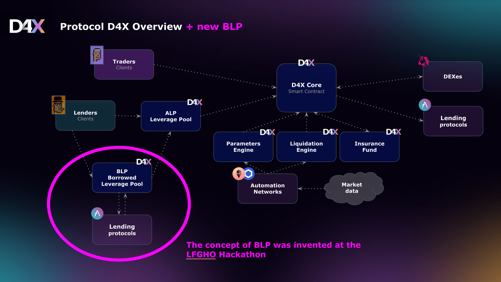
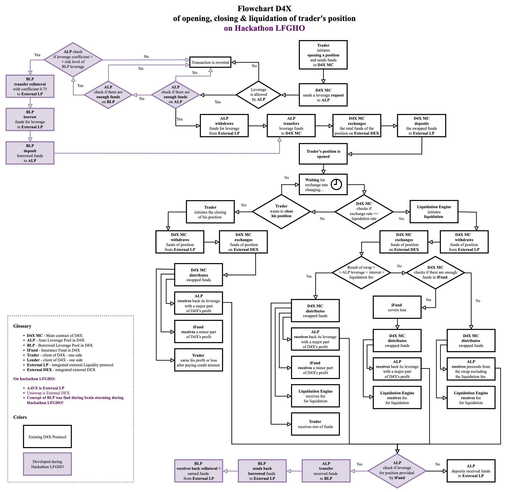

## Descriptions

### Name

**"D4X meets BLP"**

## Short Description
A fully new type of leverage pools BLP for the spot margin trading protocol d4x.io utilizes overcollateralized borrowing from AAVE and GHO - Borrowed Leverage Pool (BLP)

## Project Description

We have introduced a new type of leverage pools for the spot margin trading protocol [d4x.io](http://d4x.io/) called Borrowed Leverage Pool (BLP).

BLP offers lenders the opportunity to keep their funds in their preferred currency while simultaneously participating in the earnings from various other Auto Leverage Pools (ALP) at d4x.io.

The concept of BLP and its development are entirely the products of the creative brainstorming sessions at the LFGHO Hackathon!

For instance, a lender could deposit ETH (or even stETH) into the BLP to earn APY from all the ALPs of d4x.io, which typically only permit investments in a specific currency (for example, APL in GHO).

In the scenario where BLP provides leverage in GHO, the BLP sends ETH to AAVE as a collateral supply, borrows GHO, and then forwards the borrowed GHO to D4X to earn interest from traders.

The Decentralized Liquidation Engine (LE) controls the risks of margin calls for D4X and AAVE simultaneously.

D4X App for Hackathon [https://d4x-lfgho-hackathon.vercel.app/](https://d4x-lfgho-hackathon.vercel.app/)

Notion Hackathon Docs [https://sagart.notion.site/sagart/LFGHO-Hackathon-84b1fe479e4341e39c5b8f6566613b75](https://sagart.notion.site/sagart/LFGHO-Hackathon-84b1fe479e4341e39c5b8f6566613b75)

P.S. For a better understanding of [d4x.io](http://d4x.io)  at all and ALP, refer to their documentation at [docs.d4x.io](http://docs.d4x.io/).

## How it's Made

### During the Hackathon, our team accomplished the following:

1. We developed new BLP contracts.
2. We implemented several integration functions in the main protocol.
3. We deployed the entire [d4x.io](http://d4x.io/) protocol on the Sepolia testnet
4. We initiated all necessary testnet simulation servers.
5. We deployed the front end on Vercel.

### Tech stack:

1. We use **EVM-compatible networks**
2. Smart contracts are written in **Solidity** 0.8.9
3. Smart contracts are deployed to **Sepolia Testnet especially for LFGHO**  
4. Front-end is written in **Next Js**
5. Front-end is deployed on **Vercel**
6. We used **theGraph**
7. We used the **Rainbow kit** for connect wallets
8. Oracles by **Chainlink**
9. Automation by **Chainlink Keeper, Gelato**
10. Inegtated with different DEXes - **Uniswap for LFGHO** 
11. Integrated with external lending protocols - **AVVE for BLP** (on hackathon) and **AAVE for additional lending** in base D4X Protocol

### Principal Schema:

### Flow schemas:

